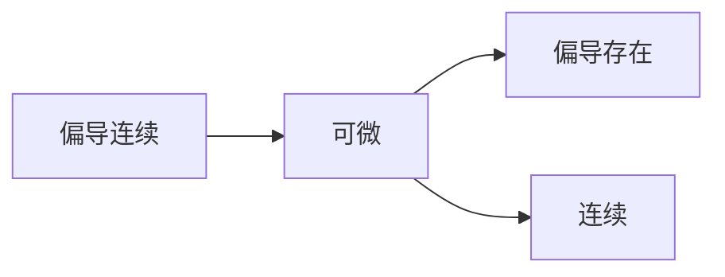

>全微分 $\Leftrightarrow$  $\Delta z=A \Delta x+B \Delta y+o(\rho)$ 其中 $\rho =\sqrt{ \Delta x^{2}+\Delta y^{2} }$  
 $dz=A \Delta x+B \Delta y=A\,dx+B\,dy$ 
 
  为什么会出现 $\rho$? $\Rightarrow$ 这个符号统一了 $\Delta x,\Delta y$ 的高阶无穷小
## 从可微到偏导
 >可微 $\Rightarrow$ 连续与可导
 >设 $z=f(x,y)$ 在 $(x_{0},y_{0})$ 点可微，则 $f(x,y)$ 在 $(x_{0},y_{0})$ 点处的两个偏导数 $f_{x}'(x_{0},y_{0}),f_{y}'(x,y)$ 都存在，且 $(x_{0},y_{0})$ 处的微分为 $dz=f_{x}'(x_{0},y_{0})d x+f_{y}'(x_{0},y_{0})d y$ 
 
 证明：
$$\Delta z=A \Delta x+B \Delta y+o(\rho)$$
取 $\Delta x\neq 0,\Delta y=0$,（偏导是偏向一个变量的，所以需要固定另一个）
$$f(x_{0}+\Delta x,y_{0})-f(x_{0},y_{0})=A \Delta x+o(\left| \Delta x \right| )$$
$$\Rightarrow A=\frac{f(x_{0}+\Delta x,y_{0})-f(x_{0},y_{0})}{\Delta x}-\frac{o(\left| \Delta x \right| )}{\Delta x}$$
取极限可得，
$$A=\lim_{ \Delta x \to 0 } \frac{f(x_{0}+\Delta x,y_{0})-f(x_{0},y_{0})}{\Delta x}=f_{x}'(x_{0},y_{0})$$
同理可得， $B=f_{y}'(x_{0},y_{0})$ 

## 从偏导到可微
偏导存在 $\nRightarrow$ 可微（但加上连续的条件就可以）

>设 $z=f(x,y)$ 在 $(x_{0},y_{0})$ 点偏导数 $f_{x}'(x_{0},y_{0}),f_{y}'(x_{0},y_{0})$ 都存在，且这两个偏导又在 $(x_{0},y_{0})$ 处连续，则 $f(x,y)$ 在 $(x_{0},y_{0})$ 点可微
**注意：此处的连续指的是偏导函数连续，而不是原函数**

## 全微分的几何意义 

- 需要注意的 $\partial$ :
- 相比于单元微分里面的 $d$ ， $\partial$ 只有在成对存在时才有意义，且不能单纯的相消
【例】
设 $z=f(x,y)=xy$ ,求 $\frac{\partial z}{\partial x}\cdot \frac{\partial x}{\partial y}\cdot \frac{\partial y}{\partial z}$ 

因为 $z=xy$ ,故 $\frac{\partial z}{\partial x}=y$ 
因为 $x=\frac{z}{y}$ ,故 $\frac{\partial x}{\partial y}=-\frac{z}{y^{2}}$ 
因为 $y=\frac{z}{x}$ ,故 $\frac{\partial y}{\partial z}=\frac{1}{x}$ 
综上，结果为-1

如何从定义的角度判定可微？
1. 首先看它的偏导数是否存在，若不存在则不可微，若存在则下一步
2. 看 $\lim_{ (x,y) \to (0,0) }\frac{\Delta f-\left[ f_{x}'\Delta x+f_{y}'\Delta y \right]}{\rho}$ 是否等于零，若为零则可微。 

